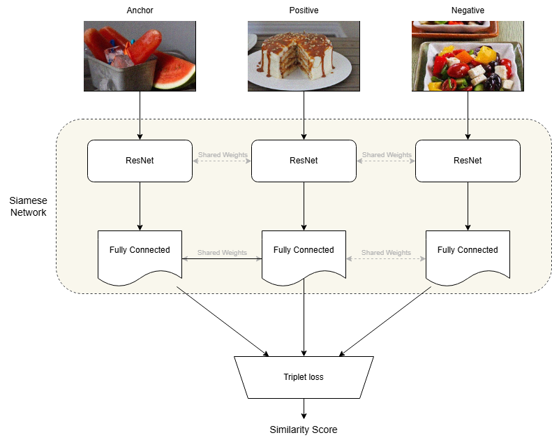

# Food Image Similarity Prediction Project

## Project Description

This project predicts whether a given food image (anchor) is more similar to a second image (positive) or a third image (negative). It uses a pretrained ResNet model to extract embeddings and a Siamese network trained with triplet loss to compare the similarity between images.

## Goal

The objective is to classify:

- `1` if the anchor is closer to the positive image.
- `0` if the anchor is closer to the negative image.

## Approach

1. **Data Splitting**:  
   - The dataset is split into training and validation sets.  
   - Triplets containing images that appear in the validation set are removed from the training set to test the model's generalization and prevent overfitting.

2. **Feature Extraction**:  
   - A pretrained ResNet model (trained on ImageNet) generates embeddings for each image in the triplets (anchor, positive, negative).  
   - The ResNet parameters are frozen to maintain their pretrained weights, and only the fully connected layers following the ResNet are trained.  

3. **Siamese Network**:  
   - A shared network processes the triplets and computes the distances between embeddings.  
   - The triplet loss ensures the anchor is closer to the positive image than the negative.  

4. **Prediction**:  
   - The network outputs binary labels based on the computed similarity between the embeddings.

## Model Architecture

